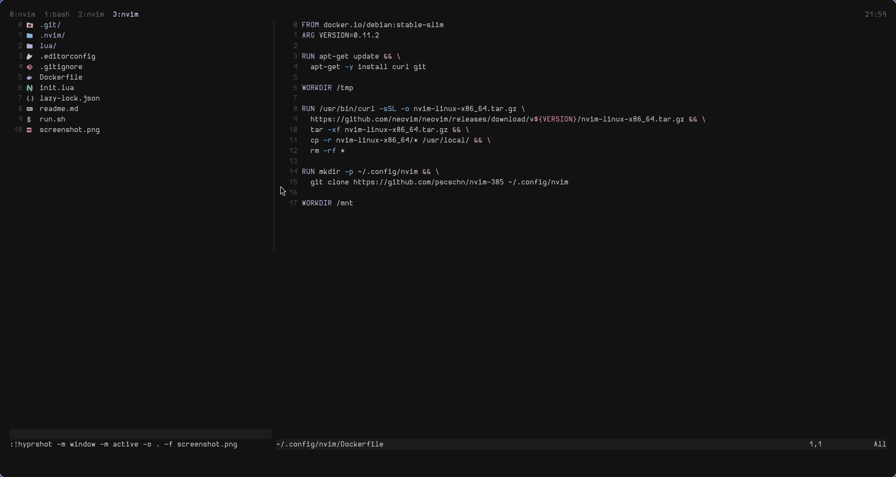

## Nvim-385

My personal nvim config.

---



---

[container/run.sh](./container/run.sh) runs a podman container with the config:

```shell
bash <(curl -s https://raw.githubusercontent.com/pscschn/nvim-385/refs/heads/master/run.sh)
```